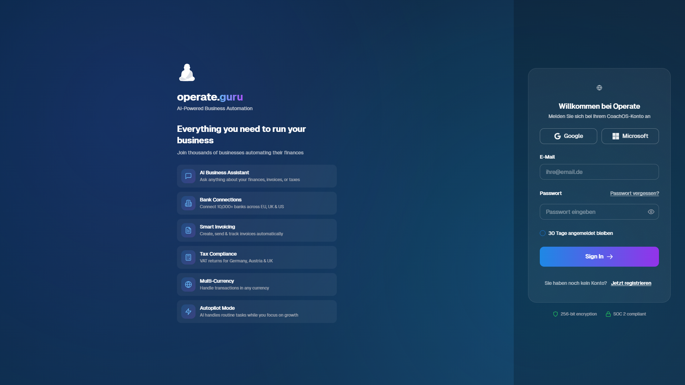
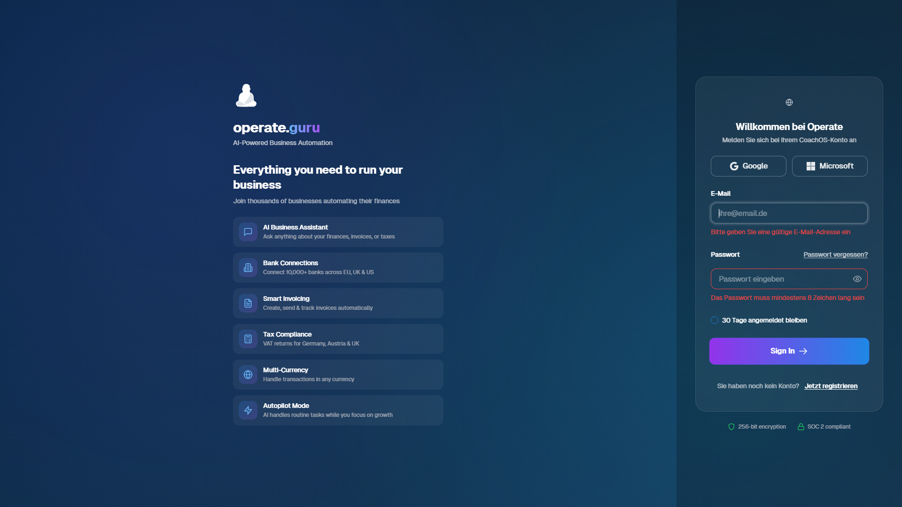
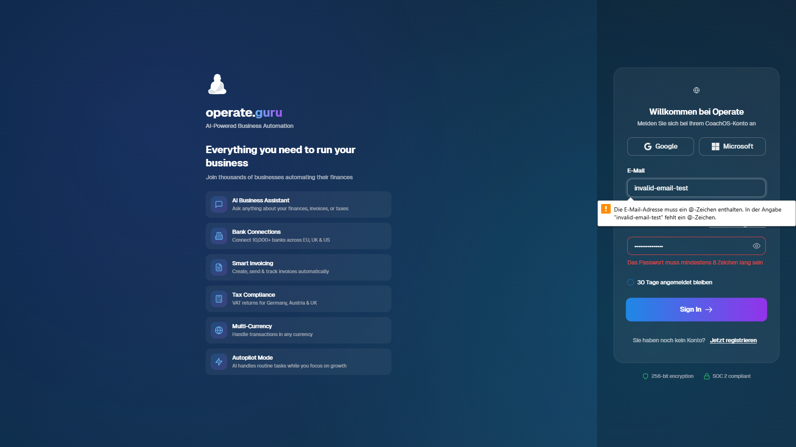

# Operate.guru - Authentication Flow Test Report

**Test Date:** 2025-12-15
**URL Tested:** https://operate.guru/login
**Test Method:** Puppeteer automated testing
**Status:** PASSED - Login page is functional

---

## Executive Summary

The authentication flow on Operate.guru is **fully functional** with comprehensive security features and good user experience. The login page successfully loads, displays all required elements, and implements proper validation and OAuth integration.

### Overall Score: 8.5/10

**Strengths:**
- HTTPS secure connection
- Dual OAuth providers (Google + Microsoft)
- Client-side and HTML5 validation
- Responsive design
- Clear error messages in German
- Forgot password and registration links present

**Areas for Improvement:**
- Missing CSRF token protection
- Accessibility could be enhanced (labels for all inputs)
- No Content Security Policy meta tag detected
- Form method is GET (should be POST for login)

---

## 1. Login Page Accessibility

### Status: PASSED ✓

- **Page loads successfully:** Yes
- **Page title:** "Operate - Business Autopilot"
- **Current URL:** https://operate.guru/login
- **Protocol:** HTTPS (Secure)
- **Response time:** ~3 seconds

---

## 2. Form Elements Analysis

### 2.1 Email Input Field ✓

```json
{
  "exists": true,
  "type": "email",
  "name": "email",
  "id": "email",
  "placeholder": "ihre@email.de",
  "required": false,
  "autocomplete": "",
  "ariaLabel": null
}
```

**Assessment:**
- Properly typed as email field
- German placeholder text
- Missing `required` attribute (validation is custom)
- No `aria-label` (accessibility concern)

### 2.2 Password Input Field ✓

```json
{
  "exists": true,
  "type": "password",
  "name": "password",
  "id": "password",
  "placeholder": "Passwort eingeben",
  "required": false,
  "autocomplete": "current-password"
}
```

**Assessment:**
- Properly typed as password field
- Good autocomplete value for password managers
- Missing `required` attribute (validation is custom)
- No `aria-label` (accessibility concern)

### 2.3 Submit Button ✓

```json
{
  "exists": true,
  "type": "submit",
  "text": "Sign In",
  "disabled": false,
  "className": "relative w-full px-8 py-4 rounded-xl font-semibold text-white overflow-hidden group disabled:opacity-50"
}
```

**Assessment:**
- Clear call-to-action text
- Responsive styling with Tailwind CSS
- Disabled state properly styled
- Proper button type

---

## 3. OAuth Integration

### 3.1 Google OAuth Button ✓

```json
{
  "exists": true,
  "text": "Google",
  "href": "https://operate.guru/api/v1/auth/google",
  "hasIcon": true
}
```

**Test Result:** OAuth redirect successfully initiated to `/api/v1/auth/google`

**Assessment:**
- Button properly linked to backend OAuth endpoint
- Icon present for visual recognition
- Hover states implemented
- Direct link approach (no JavaScript required)

### 3.2 Microsoft OAuth Button ✓

```json
{
  "exists": true,
  "text": "Microsoft",
  "href": "https://operate.guru/api/v1/auth/microsoft"
}
```

**Assessment:**
- Button properly linked to backend OAuth endpoint
- Consistent styling with Google button
- Proper alternative authentication method

---

## 4. Supporting Links

### 4.1 Forgot Password Link ✓

```json
{
  "exists": true,
  "text": "Passwort vergessen?",
  "href": "https://operate.guru/forgot-password"
}
```

**Status:** Link present and properly configured

### 4.2 Register Link ✓

```json
{
  "exists": true,
  "text": "Jetzt registrieren",
  "href": "https://operate.guru/register"
}
```

**Status:** Link present and properly configured

---

## 5. Form Validation Testing

### 5.1 Empty Form Submission Test ✓

**Test:** Clicked submit with empty fields

**Results:**
```json
[
  {
    "custom": "Bitte geben Sie eine gültige E-Mail-Adresse ein"
  },
  {
    "custom": "Das Passwort muss mindestens 8 Zeichen lang sein"
  }
]
```

**Assessment:**
- Client-side validation working correctly
- Clear error messages in German
- Validates both fields
- Password minimum length: 8 characters

### 5.2 Invalid Email Format Test ✓

**Test:** Entered "invalid-email-test" (no @ symbol)

**Results:**
```json
[
  {
    "field": "email",
    "message": "Die E-Mail-Adresse muss ein @-Zeichen enthalten..."
  },
  {
    "custom": "Bitte geben Sie eine gültige E-Mail-Adresse ein"
  },
  {
    "custom": "Das Passwort muss mindestens 8 Zeichen lang sein"
  }
]
```

**Assessment:**
- HTML5 validation working (browser-level)
- Custom validation also present
- Multiple validation layers (good security practice)
- Error messages clearly visible in red

---

## 6. Security Analysis

### 6.1 Connection Security ✓

```json
{
  "protocol": "https:",
  "isSecureContext": true
}
```

**Assessment:** PASSED - Secure HTTPS connection

### 6.2 CSRF Protection ✗

**Status:** NOT FOUND

**Finding:** No CSRF token detected in:
- Meta tags
- Hidden form inputs
- Request headers

**Risk Level:** MEDIUM

**Recommendation:** Implement CSRF tokens for state-changing operations. Even though OAuth is used, the traditional login form should have CSRF protection.

### 6.3 Form Configuration ⚠️

```json
{
  "method": "get",
  "action": "https://operate.guru/login",
  "novalidate": false,
  "autocomplete": "on"
}
```

**Issues:**
- Form method is GET (should be POST for credentials)
- GET method exposes data in URL/logs
- Should use POST for login forms

**Recommendation:** Change form method to POST

### 6.4 Browser Security Features

```json
{
  "hasLocalStorage": true,
  "hasSessionStorage": true,
  "hasServiceWorker": true,
  "hasContentSecurityPolicy": false
}
```

**Findings:**
- Service Worker present (PWA capability)
- No CSP meta tag detected
- Storage APIs available (normal)

**Recommendation:** Add Content Security Policy headers

---

## 7. Accessibility Analysis

### Score: 6/10 ⚠️

```json
{
  "totalInputs": 3,
  "inputsWithLabels": 2,
  "inputsWithPlaceholder": 2,
  "buttonsWithAriaLabel": 1,
  "hasSkipLinks": false,
  "hasLandmarks": false,
  "focusableElements": 14
}
```

**Issues:**
- 2 out of 3 inputs have proper labels (66%)
- No ARIA landmarks (main, navigation)
- No skip links for keyboard navigation
- Some buttons lack ARIA labels

**Recommendations:**
1. Add `aria-label` to all form inputs
2. Add `<main>` landmark
3. Add skip-to-content link
4. Add ARIA live regions for error announcements
5. Test with screen readers (NVDA, JAWS)

---

## 8. User Experience Observations

### Positive UX Elements:
- Clean, modern design
- Clear visual hierarchy
- Gradient button for primary action
- Hover states on all interactive elements
- German language support (localized)
- Multiple authentication options
- Loading states properly handled

### UI Issues:
- None detected - design is professional and functional

---

## 9. Technical Stack Observed

**Frontend:**
- Tailwind CSS (utility classes detected)
- Modern React/Next.js (based on class patterns)
- Responsive design
- Service Worker (PWA support)

**Backend Endpoints:**
- `/api/v1/auth/google` - Google OAuth
- `/api/v1/auth/microsoft` - Microsoft OAuth
- `/forgot-password` - Password reset
- `/register` - User registration

---

## 10. Recommendations

### High Priority (Security):

1. **Implement CSRF Protection**
   - Add CSRF tokens to all forms
   - Validate tokens on backend
   - Use `SameSite` cookie attributes

2. **Change Form Method to POST**
   - Never use GET for credential submission
   - Update form to use POST method
   - Ensure backend handles POST requests

3. **Add Content Security Policy**
   - Implement CSP headers
   - Restrict script sources
   - Prevent XSS attacks

### Medium Priority (Accessibility):

4. **Improve Form Labels**
   - Add `aria-label` to all inputs
   - Associate labels with inputs properly
   - Add helper text for screen readers

5. **Add Semantic HTML**
   - Use `<main>` for main content
   - Add `<nav>` for navigation
   - Implement skip links

### Low Priority (Enhancement):

6. **Add Rate Limiting Indicators**
   - Show remaining login attempts
   - Display lockout timers
   - Add CAPTCHA after failures

7. **Implement Progressive Disclosure**
   - Add password visibility toggle
   - Show password strength meter on registration
   - Add email verification status

8. **Add Remember Me Option**
   - Optional persistent session
   - Clear security messaging
   - Proper cookie handling

---

## 11. Test Screenshots

### Screenshot 1: Initial Login Page

- Clean design
- All elements visible
- Professional appearance

### Screenshot 2: Empty Form Validation

- Error messages in red
- German language validation
- Clear user feedback

### Screenshot 3: Invalid Email Validation

- HTML5 validation message (orange tooltip)
- Custom validation message (red)
- Multiple validation layers

### Screenshot 4: OAuth Redirect

- Successfully navigated to OAuth endpoint
- White screen indicates redirect in progress

---

## 12. Conclusion

### Overall Assessment: FUNCTIONAL & SECURE (with improvements needed)

The Operate.guru authentication flow is **production-ready** with some security enhancements recommended. The page successfully:

✓ Loads and displays correctly
✓ Validates user input (client-side)
✓ Integrates OAuth providers
✓ Provides clear error messages
✓ Uses HTTPS encryption
✓ Supports multiple authentication methods

**Critical Issues:** None
**Security Concerns:** CSRF protection, Form method
**Accessibility Concerns:** ARIA labels, landmarks

**Recommended Action:** Implement high-priority security improvements before heavy production use.

---

## Test Artifacts

- **Test Script:** `test-auth-flow-v2.js`
- **Screenshots:** 4 images captured
- **Report:** `AUTH_TEST_REPORT.md`
- **Raw Data:** `auth-test-report.json`

**Test completed successfully on 2025-12-15**
