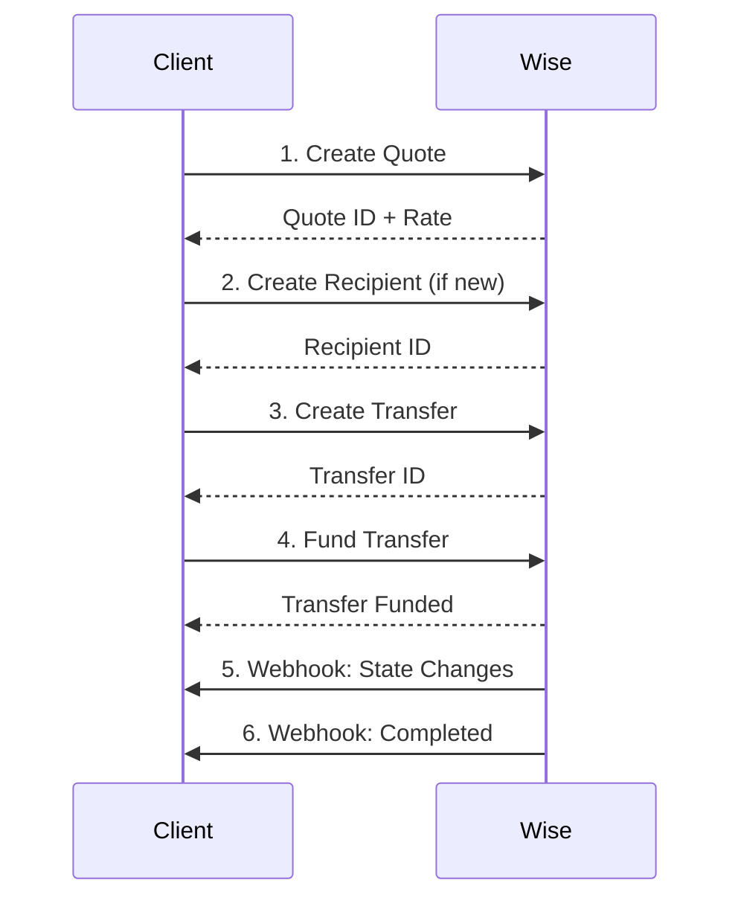

# Wise Business API Integration

Complete integration with Wise Business API for international money transfers and multi-currency account management.

## Overview

Wise (formerly TransferWise) is a global money transfer service that enables businesses to:
- Send and receive money internationally at real exchange rates
- Hold and manage money in 50+ currencies
- Pay suppliers, freelancers, and employees globally
- Convert between currencies at interbank rates

## Features

### Transfer Management
- **Real-time Quotes**: Get live exchange rates with transparent fees
- **International Transfers**: Send money to 80+ countries in 50+ currencies
- **Recipient Management**: Create and manage beneficiary accounts
- **Transfer Tracking**: Monitor transfer status in real-time
- **Delivery Estimates**: Get accurate delivery time predictions

### Multi-Currency Accounts
- **Borderless Accounts**: Hold balances in 50+ currencies
- **Local Account Details**: Get local bank details (IBAN, routing numbers, etc.)
- **Currency Conversion**: Convert between currencies at interbank rates
- **Balance Management**: Track all currency balances in one place
- **Transaction Statements**: Download detailed statements by currency

### Webhooks
- **Transfer State Changes**: Real-time notifications when transfers update
- **Balance Updates**: Get notified of deposits and withdrawals
- **Security**: HMAC-SHA256 signature verification

## Installation

The module is already integrated into the Operate/CoachOS backend.

### Environment Variables

Add to your `.env` file:

```bash
# Wise Configuration
WISE_API_TOKEN=your_api_token_here
WISE_SANDBOX=true                    # Set to false for production
WISE_PROFILE_ID=12345678             # Your business profile ID (optional)
WISE_WEBHOOK_SECRET=your_webhook_secret
WISE_ENCRYPTION_KEY=your_32_char_encryption_key_here
```

### Get API Token

1. **Sandbox** (Testing):
   - Sign up at https://sandbox.transferwise.tech/
   - Go to Settings > API tokens
   - Create a "Full access" token

2. **Production**:
   - Sign up for Wise Business at https://wise.com/business
   - Complete KYC verification
   - Go to Settings > API tokens
   - Create a "Full access" token

### Get Profile ID

```bash
# Using curl
curl -X GET "https://api.sandbox.transferwise.tech/v1/profiles" \
  -H "Authorization: Bearer YOUR_API_TOKEN"

# Using the API
GET /integrations/wise/profiles/business
```

## Usage

### 1. Create a Quote

```typescript
POST /integrations/wise/quotes

{
  "sourceCurrency": "EUR",
  "targetCurrency": "USD",
  "sourceAmount": 1000
}

// Response
{
  "id": "550e8400-e29b-41d4-a716-446655440000",
  "source": "EUR",
  "target": "USD",
  "sourceAmount": 1000,
  "targetAmount": 1095.50,
  "rate": 1.0955,
  "fee": 4.50,
  "expirationTime": "2024-01-15T11:00:00Z"
}
```

### 2. Create a Recipient

```typescript
POST /integrations/wise/recipients

// SEPA (EU) Example
{
  "currency": "EUR",
  "type": "iban",
  "details": {
    "accountHolderName": "Acme Corp GmbH",
    "legalType": "BUSINESS",
    "iban": "DE89370400440532013000"
  }
}

// US ACH Example
{
  "currency": "USD",
  "type": "aba",
  "details": {
    "accountHolderName": "Acme Corp Inc",
    "legalType": "BUSINESS",
    "abartn": "111000025",
    "accountNumber": "12345678",
    "accountType": "CHECKING"
  }
}
```

### 3. Create and Fund Transfer

```typescript
// Option A: Step-by-step
POST /integrations/wise/transfers
{
  "targetAccount": 12345678,
  "quoteUuid": "550e8400-e29b-41d4-a716-446655440000",
  "details": {
    "reference": "Invoice #12345"
  }
}

POST /integrations/wise/transfers/{transferId}/fund

// Option B: One-step execution
POST /integrations/wise/transfers/execute
{
  "sourceCurrency": "EUR",
  "targetCurrency": "USD",
  "sourceAmount": 1000,
  "targetAccount": 12345678,
  "details": {
    "reference": "Invoice #12345",
    "transferPurpose": "verification.transfers.purpose.invoice.payment"
  }
}
```

### 4. Check Balances

```typescript
// Get all balances
GET /integrations/wise/balances

// Get balance for specific currency
GET /integrations/wise/balances/EUR

// Get available amount
GET /integrations/wise/balances/EUR/available
// Response: { "currency": "EUR", "amount": 5000.00 }
```

### 5. Convert Currency

```typescript
POST /integrations/wise/balances/convert
{
  "sourceCurrency": "USD",
  "targetCurrency": "EUR",
  "sourceAmount": 1000
}
```

### 6. Get Statements

```typescript
GET /integrations/wise/statements/EUR?intervalStart=2024-01-01T00:00:00Z&intervalEnd=2024-01-31T23:59:59Z
```

## Supported Countries & Currencies

### Major Currencies
- EUR (Euro) - SEPA transfers
- USD (US Dollar) - ACH/Wire
- GBP (British Pound) - Faster Payments
- CHF (Swiss Franc)
- AUD (Australian Dollar)
- CAD (Canadian Dollar)
- JPY (Japanese Yen)
- CNY (Chinese Yuan)
- SGD (Singapore Dollar)
- HKD (Hong Kong Dollar)

### Transfer Methods by Country

#### Europe (SEPA)
- **Required**: IBAN
- **Type**: `iban`
- **Example**: DE89370400440532013000

#### United Kingdom
- **Required**: Sort Code + Account Number
- **Type**: `sort_code`
- **Example**: 231470 / 28821822

#### United States
- **Required**: ABA Routing Number + Account Number
- **Type**: `aba`
- **Account Types**: CHECKING, SAVINGS
- **Example**: 111000025 / 12345678

#### Australia
- **Required**: BSB Code + Account Number
- **Type**: `bsb_code`
- **Example**: 032000 / 12345678

#### Canada
- **Required**: Institution Number + Transit Number + Account Number
- **Type**: `institution_number`

#### India
- **Required**: IFSC Code + Account Number
- **Type**: `ifsc`

#### Mexico
- **Required**: CLABE
- **Type**: `clabe`

## Webhook Configuration

### Setup Webhook URL

1. Go to Wise Settings > Webhooks
2. Add webhook URL: `https://your-domain.com/integrations/wise/webhooks`
3. Select events:
   - `transfers#state-change`
   - `balances#credit`
   - `balances#update`
4. Copy the webhook secret to `WISE_WEBHOOK_SECRET`

### Webhook Events

```typescript
// Transfer State Change
{
  "subscriptionId": "...",
  "eventType": "transfers#state-change",
  "data": {
    "resource": { "id": 12345678 },
    "current_state": "outgoing_payment_sent",
    "previous_state": "processing"
  }
}

// Balance Credit
{
  "subscriptionId": "...",
  "eventType": "balances#credit",
  "data": {
    "amount": 1000.00,
    "currency": "EUR",
    "post_transaction_balance_amount": 5000.00
  }
}
```

## Transfer Workflow

### Standard Workflow



### Transfer States

1. **incoming_payment_waiting** - Waiting for funds
2. **processing** - Transfer being processed
3. **funds_converted** - Currency conversion done
4. **outgoing_payment_sent** - Money sent to recipient ✅
5. **cancelled** - Transfer cancelled ❌
6. **funds_refunded** - Funds returned ❌

## Error Handling

The integration handles common errors:

```typescript
try {
  await wiseTransferService.executeTransfer(dto);
} catch (error) {
  if (error.status === 400) {
    // Invalid request (e.g., invalid IBAN)
  } else if (error.status === 401) {
    // Invalid API token
  } else if (error.status === 403) {
    // Insufficient permissions
  } else if (error.status === 429) {
    // Rate limit exceeded
  } else if (error.status === 500) {
    // Wise service error
  }
}
```

## Security

### API Token Encryption
- Tokens encrypted with AES-256-GCM before storage
- Master key derived using PBKDF2 (100,000 iterations)
- Salt and IV randomized per encryption

### Webhook Verification
- HMAC-SHA256 signature verification
- Timing-safe comparison to prevent timing attacks
- Automatic rejection of invalid signatures

### Audit Logging
- All API calls logged (without sensitive data)
- Transfer creation and funding tracked
- Webhook events logged with delivery IDs

## Rate Limits

Wise API rate limits:
- **Sandbox**: 60 requests/minute
- **Production**: 300 requests/minute

The integration includes:
- Automatic retry with exponential backoff
- Rate limit error handling
- Caching of frequently accessed data

## Testing

### Sandbox Testing

```bash
# Set sandbox mode
WISE_SANDBOX=true

# Test webhook
POST /integrations/wise/webhooks/test
{
  "eventType": "transfers#state-change",
  "data": {
    "resource": { "id": 12345678 },
    "current_state": "outgoing_payment_sent",
    "previous_state": "processing"
  }
}
```

### Test Transfers in Sandbox

Sandbox automatically processes transfers:
- Quotes are generated with real rates
- Transfers complete instantly
- No real money is moved

## Cost Structure

Wise fees are transparent and competitive:

| Corridor | Fee | Speed |
|----------|-----|-------|
| EUR → USD | ~0.45% | 1-2 days |
| GBP → EUR | ~0.35% | 1 hour |
| USD → GBP | ~0.45% | 1-2 days |
| EUR → EUR (SEPA) | €0.50 | 1 hour |

## Integration Checklist

- [ ] Set up Wise Business account
- [ ] Complete KYC verification
- [ ] Generate API token
- [ ] Configure environment variables
- [ ] Test in sandbox
- [ ] Set up webhook endpoint
- [ ] Test webhook events
- [ ] Create first recipient
- [ ] Execute test transfer
- [ ] Switch to production
- [ ] Monitor first live transfer

## API Reference

Full API documentation: https://api-docs.wise.com/

### Key Endpoints

- `GET /profiles` - Get all profiles
- `POST /quotes` - Create quote
- `POST /accounts` - Create recipient
- `POST /transfers` - Create transfer
- `POST /transfers/{id}/payments` - Fund transfer
- `GET /balances` - Get balances
- `POST /balance-movements` - Convert currency

## Support

- Wise API Docs: https://api-docs.wise.com/
- Wise Support: https://wise.com/help/
- Slack: #wise-integration (internal)

## Changelog

### v1.0.0 (2024-12-02)
- Initial implementation
- Quote creation
- Recipient management
- Transfer execution
- Multi-currency balances
- Currency conversion
- Webhook handling
- Comprehensive error handling
